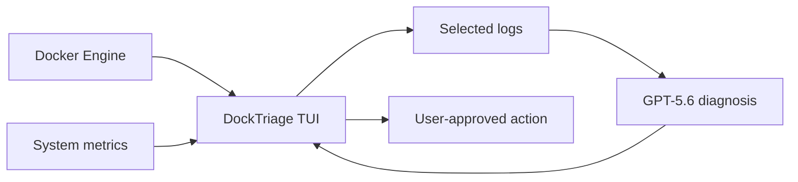

# DockTriage

> **Understand container failures. Fix them from your terminal.**

DockTriage is an AI-powered Docker management and troubleshooting TUI for developers, students, and homelab users. It combines system monitoring, container controls, live logs, and plain-language failure analysis in one terminal interface.

## The problem

Diagnosing a failed Docker container often means switching between commands, reading hundreds of log lines, and searching for unfamiliar error messages. This is particularly difficult for people learning Docker or managing a homelab without a full observability platform.

## The solution

DockTriage provides one focused terminal workspace where users can:

- Monitor CPU and memory usage.
- View running, stopped, and unhealthy containers.
- Start, stop, restart, or kill a selected container.
- Follow the selected container's logs.
- Ask questions such as **"Why is this container restarting?"**
- Receive a concise explanation, supporting evidence, and safe troubleshooting steps.

The goal is not to hide Docker. It is to help users understand what Docker is reporting and make a confident decision about what to do next.

## Build Week MVP

- [ ] System CPU and memory dashboard
- [ ] Docker container list with status and health
- [ ] Start, stop, restart, and kill controls
- [ ] Live log viewer
- [ ] GPT-5.6-powered log analysis
- [ ] Human approval before every container-changing action
- [ ] Automated tests and a reproducible demo container

> **Current status:** Build Week prototype under active development.

## Built with Codex and GPT-5.6

### How Codex is being used

Codex is the engineering collaborator for DockTriage. It is being used to:

- Design the application architecture and keep the Build Week scope achievable.
- Implement the Dart and Nocterm terminal interface.
- Build and debug the Docker Engine API integration.
- Create tests, reproducible demo scenarios, and installation instructions.
- Review the project for reliability, security, and accidental secret exposure.
- Maintain the README and supporting documentation.

Codex-generated changes are reviewed and tested before they are accepted.

### How GPT-5.6 is used in the product

GPT-5.6 powers DockTriage's diagnostic assistant. When the user requests an analysis, DockTriage sends relevant container metadata and a selected log excerpt. GPT-5.6 returns a structured diagnosis containing:

1. A plain-language summary.
2. The most likely cause.
3. Evidence found in the logs.
4. Recommended troubleshooting steps.
5. An uncertainty note when the available evidence is insufficient.

GPT-5.6 is used for reasoning and explanation, not unrestricted machine control. It does not automatically execute generated shell commands or change container state.

## Safety principles

- Every start, stop, restart, or kill operation is initiated or confirmed by the user.
- AI-generated commands are suggestions only.
- API keys are read from environment variables and must never be committed.
- Log sharing is explicit and limited to the excerpt selected for diagnosis.
- Destructive operations require an additional confirmation step.

## Architecture



## Technology

- Dart
- Nocterm
- Docker Engine API
- OpenAI API with GPT-5.6
- Linux terminal environment

## Supported platforms

The initial Build Week release targets **Linux with Docker Engine**. WSL2 support is experimental. Native macOS and Windows support are planned after the MVP.

## Development setup

Prerequisites:

- Docker Engine
- Dart SDK 3.x
- Git
- An OpenAI API key
- Permission to access the local Docker daemon

```bash
git clone https://github.com/gptchatpro047-ship-it/docktriage.git
cd docktriage
dart pub get
export OPENAI_API_KEY="your-api-key"
dart run bin/docktriage.dart
```

Confirm Docker access:

```bash
docker ps
```

Run automated tests:

```bash
dart test
```

Installation commands will become functional when the first executable MVP is committed.

## Intended demo

1. Launch DockTriage.
2. View system utilization and container status.
3. Select a failed or restarting container.
4. Inspect its recent logs.
5. Ask GPT-5.6 to diagnose the failure.
6. Review the explanation and recommended steps.
7. Explicitly approve any container action.

## License

DockTriage is released under the [MIT License](LICENSE).
